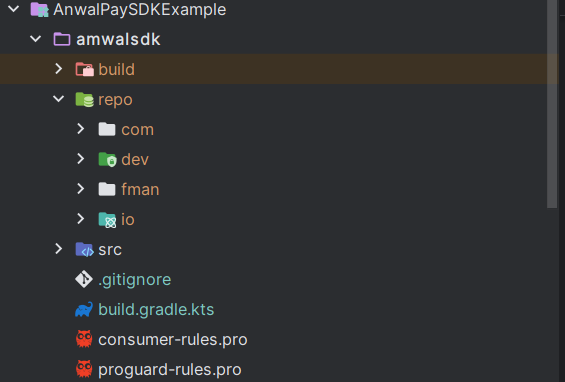

# amwal_sdk_flutter_module

A new Flutter module project.

## Getting Started

Add 
flutter.hostAppProjectName=amwalsdk
in .android/gradle.properties if u wanna compile the module in amwal_sdk_flutter_module

in [local.properties](../AnwalPaySDKNativeExample/local.properties)
compileFlutterModule=true

make sure [pubspec.yaml](pubspec.yaml) pubspec pub get

in another Android native project locally 

After Building AAR move /build/outputs/repo to amwalsdk
it should look like this 

